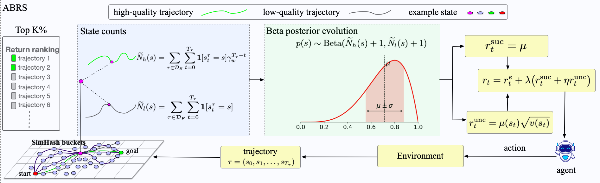

# ABRS: Asymmetric Beta-Posterior Reward Shaping

Asymmetric Beta-Posterior Reward Shaping (ABRS) is a reward-shaping method for
sparse-reward reinforcement learning. It groups continuous states with SimHash,
updates asymmetric Beta posteriors from online trajectory quality labels, and
uses posterior statistics to provide dense guidance during policy learning.

[Paper Link to be updated]

An overview of the ABRS framework:



This implementation integrates ABRS with SAC for sparse-reward continuous
control tasks.

## Requirements

- Python 3.10+
- `gymnasium`
- `shimmy[dm-control]`
- `numpy`
- `torch`
- `tensorboard`
- `tyro`
- `matplotlib`

Install dependencies with:

```bash
uv sync
```

## Run ABRS Algorithm

The main entry is `SAC_ABRS.py`, and the backbone algorithm is SAC.

ABRS + SAC:

```bash
uv run python ABRSCode/SAC_ABRS.py
```

SAC ablation without ABRS:

```bash
uv run python ABRSCode/SAC_ABRS.py --abrs-lambda 0
```

ABRS success reward only:

```bash
uv run python ABRSCode/SAC_ABRS.py --abrs-eta 0
```

Logs are saved to `runs/`. View with:

```bash
tensorboard --logdir runs
```

## Key Arguments

- `--exp-name`: experiment name for logging.
- `--env-id`: environment ID. Default:
  `dm_control/cartpole-swingup_sparse-v0`.
- `--seed`: random seed.
- `--total-timesteps`: total training steps.
- `--num-envs`: number of vectorized environments.
- `--buffer-size`, `--batch-size`: replay buffer and training batch sizes.
- `--policy-lr`, `--q-lr`: actor and critic optimizer learning rates.
- `--gamma`, `--tau`: SAC discount and target-network update coefficient.
- `--autotune`, `--alpha`: entropy-temperature configuration.
- `--abrs-lambda`: overall ABRS reward scale.
- `--abrs-eta`: uncertainty reward scale inside ABRS.
- `--abrs-top-k-percent`: top percentage of completed trajectories treated as
  high quality.
- `--abrs-credit-gamma-w`: backward credit discount for high-quality
  trajectories.
- `--abrs-hash-bits`: number of SimHash bits for state aggregation.
- `--abrs-reward-state`: use `next` or `current` states for ABRS rewards.
- `--abrs-save-beta-snapshots`: save Beta posterior snapshots to `runs/`.

## Files

- `SAC_ABRS.py`: training entry (SAC + ABRS).
- `abrs.py`: ABRS reward module with SimHash aggregation, online trajectory
  ranking, and Beta-posterior reward computation.
- `ABRS.png`: overview figure for the ABRS framework.
- `__init__.py`: package marker for `ABRSCode`.
